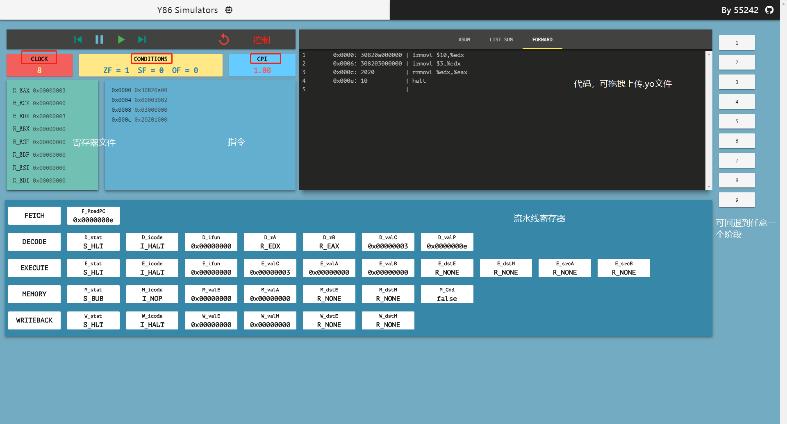

# Y86 -CPU

> a simple y86 cpu

## 环境配置

需要安装`node.js`环境，安装好之后，进入当前文件夹：

``` bash
# install dependencies
npm install
# serve with hot reload at localhost:8080
npm run dev
```

之后在浏览器(推荐`Chrome`,或其他现代浏览器)中打开`localhost:8080`,就可以看到Y86-CPU的界面。

## 使用说明

网站中初始的测试数据为`/src/test`文件夹下的`asum.yo`、`List_Sum.yo`、`Halt.yo`三个文件。

网站支持拖拽上传，仅支持`*.yo`文件，上传后将出现在最后一个`tab`中。

有五种控制按键，从左到右依次为`单步后退`、`暂停`、`自动运行`、`单步前进`、`Reset`。

网站中显示的数据有：`cycle`、`ZF OF CF`、`cpi`、`各个寄存器的值`、`写入代码之后内存的情况及变化`、`流水线的各个阶段的寄存器的值`、`最右侧的执行历史，点击可以跳转到之前执行的某个cycle`。

当流水线中寄存器数值发生变化时，会有相应的动画。

为了让动画效果更明显，默认频率的4Hz。

当切换`tab`后，执行状态会执行`Reset` 。

测试数据的内存不宜过大。



## javaScript

`javaScript`执行环境是单线程。

所谓"单线程"，就是指一次只能完成一件任务。如果有多个任务，就必须排队，前面一个任务完成，再执行后面一个任务，以此类推。

这种模式的好处是实现起来比较简单，执行环境相对单纯；坏处是只要有一个任务耗时很长，后面的任务都必须排队等着，会拖延整个程序的执行。常见的浏览器无响应（假死），往往就是因为某一段Javascript代码长时间运行（比如死循环），导致整个页面卡在这个地方，其他任务无法执行。

为了解决这个问题，Javascript语言将任务的执行模式分成两种：同步（Synchronous）和异步（Asynchronous）。

"同步模式"就是上一段的模式，后一个任务等待前一个任务结束，然后再执行，程序的执行顺序与任务的排列顺序是一致的、同步的；"异步模式"则完全不同，每一个任务有一个或多个回调函数（callback），前一个任务结束后，不是执行后一个任务，而是执行回调函数，后一个任务则是不等前一个任务结束就执行，所以程序的执行顺序与任务的排列顺序是不一致的、异步的。

"异步模式"非常重要。在浏览器端，耗时很长的操作都应该异步执行，避免浏览器失去响应，最好的例子就是Ajax操作。在服务器端，"异步模式"甚至是唯一的模式，因为执行环境是单线程的，如果允许同步执行所有http请求，服务器性能会急剧下降，很快就会失去响应。

## 并行

由于`javaScript`本身已经可以实现异步操作，与其相关的多线程操作的库几乎没有，即使有实现起来也比较难且功能也不全，所以采用`javaScript`本身的异步特性来实现并行。

采用`async`这个模块来实现并行操作。

```
Async is a utility module which provides straight-forward, powerful functions for working with asynchronous JavaScript. Although originally designed for use with Node.js and installable via npm install --save async, it can also be used directly in the browser.
```

### 串行操作

``` javascript
this.writeBack();
this.memory();
this.execute();
this.decode();
this.fetch();
```

采用并行操作来保证每个阶段的结果正确。

### 并行操作

这并不是真正的多线程实现（由于语言特性没有办法实现），是一种模拟的并行操作。

（javascipt的异步是对`kicking-off I/O tasks`阻塞的IO进行操作，所以采用sleep来实现阻塞从而实现异步）

``` javascript
function sleep(ms) {
    return new Promise(resolve => setTimeout(resolve, ms))
};
```

``` javascript
async.parallel([
    async.asyncify(async function f1() {
        await sleep(Math.random() * 200);
        writeBack(that);
    }),
    async.asyncify(async function f2() {
        await sleep(Math.random() * 200);
        memory(that);
    }),
    async.asyncify(async function f3() {
        await sleep(Math.random() * 200);
        execute(that);
    }),
    async.asyncify(async function f4() {
        await sleep(Math.random() * 200);
        fetch(that);
    }),
], function(err, res) {
    decode(that);
})
```

`writeBack`、`memory`、`execute`、`fetch`四个阶段异步执行，执行结束后在进入`decode`阶段，因为`decode`阶段需要数据的转发。

